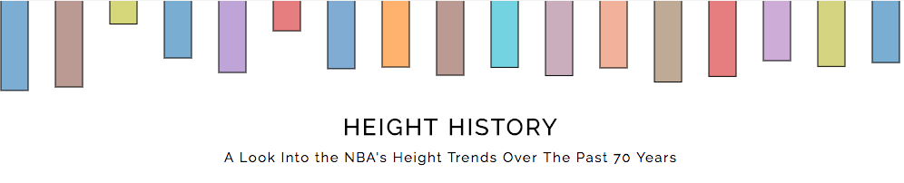
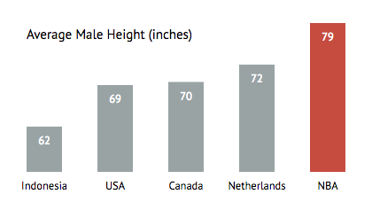
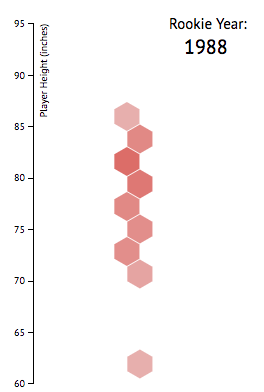
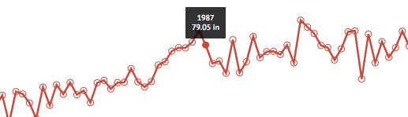

# NBA Height History

Work in progress.

## Overview

The NBA is the only league in which there is a clear advantage towards those with superior genetics, more specifically,
towards height. *NBA Height History* takes a look at the height trends throughout the last 70 years of the NBA, and how
it has impacted the game of basketball.

## Details

This project started out as an introduction to D3 and JavaScript but is now slowly turning into a very enjoyable adventure into
the world of data visualization and exploring the realm of genetics in the NBA.

The webpage is seperated into several sections, each with its own unique data visualization component.
Created using D3.js and data scraped from basketball-reference.com

1. Height Comparison Bar Chart
    - Simple bar chart using D3
    - Inspired by Darkhorse Analytics' [Data Looks Better Naked Blog](https://www.darkhorseanalytics.com/blog/data-looks-better-naked)

2. Height Histogram
    - Hexbin histogram animation to show the distribution change in height
    - Inspired by Mike Bostock's [Dynamic Hexbin](https://bl.ocks.org/mbostock/7833311)

3. Average Height Trend Chart
    - Simple line chart with hover effects
    - Hover effects created with [d3-tip](https://github.com/Caged/d3-tip)

## TODO
 - Change the last plot to different visualization
 - Add hover effects to any part of the plot in the line graph
 - Continue writing about the effects height had on the game of basketball