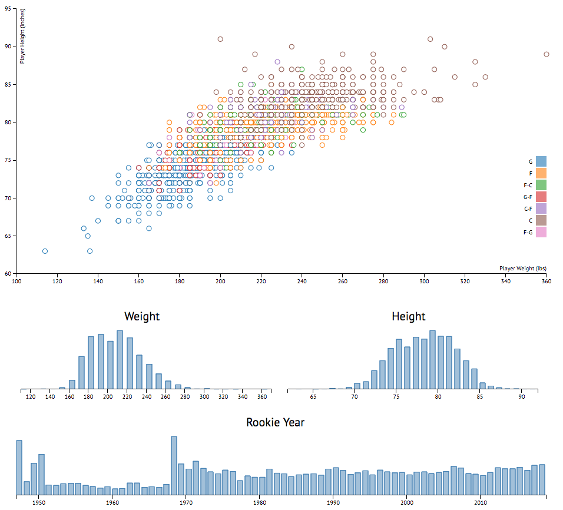

# Built To Ball
## A breakdown of the NBA's genetic history
### Inspired by my fascination with visualizations mixed with my passion for sports.

Work in progress.

Basketball is a game of endurance, precision, agility, and speed. It takes years of dedication and hard work to become a professional athlete, for basketball however, it can take a little more than just that. Out of the four major professional sports leagues, the NBA is the only league where the players can be spotted at any public venue, simply because of their height. **Built To Ball** is dedicated to exploring the significance of a player's height in their ability to make it to the NBA and how an NBA player's height and genetic makeup has impacted the game of basketball over the years.

## Thoughts
The creation of Built To Ball is currently being documented in a series of blog posts that can be found [here](https://medium.com/built-to-ball).

**Stage 1: Data Collection**: The essence behind every data visualization project is the data itself. As soon as I decided I wanted to spend my holidays building something unique to further explore my new found interest of data visualization, I began to look for the perfect dataset. [Read More...](https://medium.com/built-to-ball/the-making-of-built-to-ball-e39dba7bbfa2)

**Stage 2: Data Playground**: With a data file of over 4500 records, I needed a way to visualize all of the data at once. The first thing I made was a simple D3 scatter plot, allowing me to jump right into the data while also providing a way to ease into the D3 world with a refresher on JavaScript. [Read More...](https://medium.com/built-to-ball/stage-2-playing-with-data-10524ed210ff)
